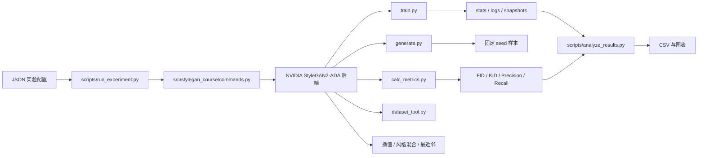

# StyleGAN2-ADA 课程设计项目

更新时间：2026-06-08

## 项目概述

课程题目为“基于 StyleGAN 的图像生成”。本项目以 NVIDIA 官方
`stylegan2-ada-pytorch` 为计算后端，在固定上游提交的基础上，建立了配置驱动的数据准备、
训练、权重热启动、生成、正式评估、结果汇总和定性分析流程。

项目没有重新实现 StyleGAN2 网络，主要工作是：

1. 适配 Python 3.12、PyTorch 2.8、CUDA 12.8 和 NumPy 2.x；
2. 在 LSUN Church Outdoor 256x256 数据上完成基线训练；
3. 用 E1-E5 因素矩阵比较无增强、固定增强、ADA、数据规模和 ADA target；
4. 用第二随机条件复核关键现象；
5. 汇总 FID、KID、Precision、Recall、训练曲线、样本、插值、风格混合和最近邻证据。

当前实验、评估和主要图表已经完成，不需要继续追加训练。正式报告、数据溯源回填和最终提交整理
尚未完成，具体状态见 [项目进度清单.md](项目进度清单.md)。

## 课程要求

- 提交实验代码和中文课题报告；
- 报告采用小论文形式，至少 20 页；
- 报告包含摘要、引言、研究方法、实验与结果分析、结论和参考文献；
- 代码应说明环境、数据、运行方法和实验结果；
- 截止时间：**2026-06-30 24:00**；
- 提交渠道：智慧树；
- 独立完成，严禁抄袭。

## 研究问题

项目的实际研究问题已经收敛为：

> 在 LSUN Church Outdoor 有限数据条件下，数据增强策略、数据规模和 ADA target 如何影响
> StyleGAN2-ADA 的生成质量、多样性与训练行为？

主指标为 FID，辅以 KID、Precision、Recall、ADA 概率、损失、训练资源和定性样本。最终结论不能
只依赖单个指标。

## 技术基线

| 项目 | 选择 |
|---|---|
| 后端 | NVIDIA StyleGAN2-ADA PyTorch |
| 固定提交 | `d72cc7d041b42ec8e806021a205ed9349f87c6a4` |
| 目标系统 | Ubuntu 22.04 |
| Python | 3.12 |
| PyTorch | 2.8.0+cu128 |
| CUDA | 12.8 devel |
| NumPy | `>=2.0,<2.3` |
| 正式数据 | LSUN Church Outdoor，256x256，100,000 张 |
| 基配置 | `paper256`，非条件生成 |

`torch==2.8.0+cu128` 按 NumPy 2.x 构建。NumPy 1.x 会导致
`torch.from_numpy()` 等接口出现 ABI 错误，因此不能把 NumPy 降到 1.26。

## GPU 使用口径

项目同时使用过单卡、双卡、四卡和六卡机器，但含义不同：

| 阶段 | 单个任务用卡 | 机器总卡数与调度 |
|---|---:|---|
| P0 流程验证 | 1 | 单卡训练 |
| P1 100 kimg 短跑 | 1 | 单卡训练 |
| P1 2000 kimg 正式基线 | 2 | 单个双卡 run |
| P2 E2-E5 因素矩阵 | 每个 run 2 | 四卡机器同时运行两个双卡 run |
| seed=1 的 E1b/E2b/E4b | 每个 run 2 | 六卡机器同时运行三个双卡 run |
| 正式 FID/KID/PR 评估 | 1 | 可在多卡机器上一卡一组并行 |

因此，正式模型训练的配置仍是每组 `gpus=2`。四卡和六卡用于并行多个相互独立的双卡实验，
不是把单个模型改成四卡或六卡训练。离线评估统一为 `gpus=1`，因为 PyTorch 2.8 下双卡
`pr50k3_full` 收尾可能触发 NCCL/TCPStore 错误。

## 项目架构



代码分为三层：

1. `src/stylegan_course/`：路径、配置、命令构造和 P0 轻量指标；
2. `scripts/`：环境、数据、训练、评估、分析和可视化入口；
3. `third_party/stylegan2-ada-pytorch/`：固定的 NVIDIA 官方后端及兼容修改。

## 目录说明

| 路径 | 作用 |
|---|---|
| `configs/baseline/` | P0、P1、P2 和 seed=1 配置 |
| `src/stylegan_course/` | 项目公共 Python 模块 |
| `scripts/` | 数据、训练、评估和分析脚本 |
| `patches/` | 五类现代环境兼容补丁 |
| `tests/` | 命令、配置、数据和分析测试 |
| `data/` | 数据说明、原始数据与转换 ZIP |
| `results/runs/` | 训练日志、指标与快照 |
| `results/analysis/` | CSV 汇总和曲线图 |
| `results/samples/` | 固定 seed、截断、插值和风格混合样本 |
| `results/nn/` | 训练集最近邻结果 |
| `report/` | P0/P1/P2 计划与执行记录 |
| `report/course_materials/` | 课程要求 PDF 和报告模板等原始材料 |
| `checkpoints/` | 模型发布位置说明 |

正式数据、训练结果、快照和归档包默认不纳入版本控制。

## 后端兼容修改

五类补丁分别处理：

1. PyTorch 2.x `InfiniteSampler` 和 `grid_sample` 二阶梯度；
2. Pillow API 与现代 PyTorch 警告；
3. Python 3.12 移除 `distutils`；
4. 多卡快照时忽略 `noise_const` DDP 一致性差异；
5. 现代 torch 不接受 NumPy scalar 的问题。

干净环境使用以下命令下载固定后端并应用补丁：

```bash
python scripts/bootstrap_stylegan2_ada.py
```

## 数据集

正式数据为 LSUN Church Outdoor：

- 100,000 张训练图像；
- 中心裁剪并缩放到 256x256 RGB；
- 无类别标签；
- 训练时 `mirror=true`；
- 转换文件：`data/processed/lsun-church-256-100k.zip`。

详细下载、转换和待回填信息见 `data/lsun_church256.md`。当前仍缺下载日期、实际来源、
原始数据大小、转换 ZIP 大小和校验值，不能凭空补写。

数据转换命令：

```bash
python scripts/prepare_data.py convert \
  --source data/raw/lsun/church_outdoor_train_lmdb \
  --dest data/processed/lsun-church-256-100k.zip \
  --resolution 256x256 \
  --transform center-crop \
  --max-images 100000
```

如果目标 ZIP 已存在，脚本会检查 ZIP 结构、`dataset.json`、图像数量和首张图分辨率，不再直接跳过。

## 实验路线

原 P2 问题诊断、P3 方向选择和 P4 正式实验最终合并为围绕中心基线的一因素矩阵。

| 组 | 数据 | 增强 | 预算 | seed | 作用 |
|---|---:|---|---:|---:|---|
| E1 | 100k | ADA target=0.6 | 2000，公平点 1512 | 42 | 中心基线 |
| E2 | 100k | noaug | 1500 | 42 | 无增强消融 |
| E3 | 100k | fixed p=0.2 | 1500 | 42 | 固定增强对照 |
| E4 | 50k | ADA target=0.6 | 1500 | 42 | 数据规模对照 |
| E5 | 100k | ADA target=0.4 | 1500 | 42 | target 敏感性 |
| E6 | 100k | ADA target=0.8 | 1500 | 42 | 可选，未运行 |
| E1b | 100k | ADA target=0.6 | 1500 | 1 | E1 重复条件 |
| E2b | 100k | noaug | 1500 | 1 | E2 重复条件 |
| E4b | 50k | ADA target=0.6 | 1500 | 1 | E4 重复条件 |

公平比较统一取约 1500 kimg。E1 使用最接近的 1512 kimg 快照；2000 kimg 模型只用于更充分训练后的
最终展示。

E4/E4b 的训练 seed 还决定 50k 子集抽样，因此二者不只是模型初始化不同。E4 的跨条件范围同时包含
模型随机性和子集抽样差异。

## 主要结果

### 1500 kimg 公平比较

| 组 | FID | KID | Precision | Recall |
|---|---:|---:|---:|---:|
| E1 | 16.6320 | 0.01110 | 0.58866 | 0.06016 |
| E2 | 18.5858 | 0.01126 | 0.55718 | 0.02829 |
| E3 | 16.4660 | 0.00910 | 0.62412 | 0.02627 |
| E4 | 15.8153 | 0.00820 | 0.54710 | 0.03670 |
| E5 | 15.4791 | 0.00749 | 0.60424 | 0.02998 |

E1 在 2000 kimg 的 FID 为 `12.9963`。FID 总体下降但不是严格单调：1814 kimg 为
13.2075，1915 kimg 回升到 14.0404，2000 kimg 再降到 12.9963。

### 重复条件

| 组 | seed=42 | seed=1 | FID 均值 | 范围 |
|---|---:|---:|---:|---:|
| E1 | 16.6320 | 15.9255 | 16.2788 | 15.9255-16.6320 |
| E2 | 18.5858 | 18.8723 | 18.7290 | 18.5858-18.8723 |
| E4 | 15.8153 | 14.0132 | 14.9142 | 14.0132-15.8153 |

### 资源记录

| 组 | 总时长 | 最终 ADA p | 峰值显存 | 最后一段 sec/kimg |
|---|---:|---:|---:|---:|
| E1 2000 | 7.35 h | 0.1531 | 3.24 GB | 10.94 |
| E2 | 4.56 h | 0 | 3.07 GB | 9.33 |
| E3 | 4.98 h | 0.2 | 3.16 GB | 9.98 |
| E4 | 5.05 h | 0.1336 | 3.15 GB | 9.98 |
| E5 | 5.04 h | 0.3758 | 3.17 GB | 9.68 |

这些时长对应单个双卡 run 的墙钟时间，不是四卡或六卡机器的总运行时长。

## 结论口径

### 证据较强

**ADA 相比 noaug 改善 FID。**

E1 和 E2 在 seed=42、seed=1 下排序一致，两个范围不相交。这是当前最稳健的主结论。

### 必须限定

**固定 1500 kimg 图像曝光预算下，50k 条件没有表现出更差 FID。**

不能把它解释为“数据越少越好”，因为：

- 50k 条件在相同 kimg 下经历更多等效 epoch；
- E4/E4b 使用不同 50k 子集；
- E4 的离散范围明显更大；
- FID 不能单独说明泛化和多样性。

### 探索性结果

- E3 的 Precision 最高、Recall 最低，呈现偏保真、弱覆盖趋势；
- E5 的单种子 FID/KID 最好，但没有第二种子；
- 较低 ADA target 会推动更高增强概率；
- “target=0.4 最优”证据不足，不能写成普遍规律。

## 定性结果

现有结果显示：

- 2000 kimg 模型能够生成稳定的教堂主体、天空、树木和前景层次；
- 风格混合能够交换粗粒度结构与细粒度外观；
- W 空间插值连续，没有明显跳变；
- 训练数据中的图库水印会被模型复现，并沿插值轨迹持续存在；
- E1 最近邻拼图没有出现近乎像素复制的训练样本。

水印现象应称为“训练数据污染特征被模型学习和复现”，不能在缺少直接证据时称为模型记忆了某张
训练样本。

## 命令入口

统一入口：

```text
train
warm-start
generate
evaluate
```

`warm-start` 只加载 G/D/G_ema 权重并启动新训练，不恢复优化器、ADA 状态或已完成 kimg。
旧 `resume` 命令仅作为兼容别名。

示例：

```bash
# 训练配置检查
python scripts/run_experiment.py train \
  --config configs/baseline/p1_lsun_church256_baseline.json \
  --dry-run

# 正式训练
python scripts/run_experiment.py train \
  --config configs/baseline/p1_lsun_church256_baseline.json

# 从网络权重热启动新训练
python scripts/run_experiment.py warm-start \
  --config configs/baseline/p1_lsun_church256_baseline.json \
  --network latest --kimg 100

# 生成样本
python scripts/run_experiment.py generate \
  --config configs/baseline/p1_lsun_church256_baseline.json \
  --network latest

# 单卡正式评估
python scripts/run_experiment.py evaluate \
  --config configs/baseline/p1_lsun_church256_baseline.json \
  --network latest
```

P2 四卡并行脚本：

```bash
GPU_PAIRS="0,1 2,3" bash scripts/run_p2_parallel.sh
```

这里会同时启动两个独立的双卡 run。

seed=1 六卡并行脚本：

```bash
GPU_PAIRS="0,1 2,3 4,5" bash scripts/run_p2_seed1.sh
```

这里会同时启动三个独立的双卡 run。

## 环境与复现

```bash
conda env create -f environment.yml
conda activate stylegan2-ada-course-blackwell
python scripts/bootstrap_stylegan2_ada.py
python scripts/preflight.py --strict
python scripts/prepare_data.py convert ...
python scripts/run_experiment.py train --config <config> --dry-run
python scripts/run_experiment.py train --config <config>
```

指标网络需要从 NVIDIA CDN 下载并缓存：

- `inception-2015-12-05.pkl`：FID、KID、最近邻；
- `vgg16.pt`：Precision/Recall。

## 分析产物

`scripts/analyze_results.py` 输出：

- `learning_curves.csv`；
- `summary.csv`；
- `fair_comparison.csv`；
- `seed_aggregate.csv`；
- FID、ADA、G/D loss 和跨条件对比图。

`summary.csv` 为每个指标记录 `*_final_kimg` 和 `*_final_eval_count`，避免把不同快照的指标误认为
来自同一个模型。FID 图中只有一个评估点的实验会标记为 `final only`。

主要产物位于：

```text
results/analysis/
results/samples/
results/nn/
```

## 测试状态

- 20/20 项不依赖 GPU 的单元测试通过；
- 21 个项目 Python 文件 AST 解析通过；
- 11 份 JSON 配置可解析；
- 所有正式配置的离线评估均为 `gpus=1`、`mirror=false`；
- 本地后端五类兼容修改的关键代码模式检查通过。

运行测试：

```bash
python -m unittest discover -s tests -v
```

## 已知限制

1. LSUN 数据下载日期、实际来源、原始大小、ZIP 大小和校验值待回填；
2. `results/logs/environment.json` 不能完整代表后续双卡训练和当前代码状态；
3. E1 缺少与 E2-E5 完全同口径的 1512 kimg 单图样本集；
4. seed=1 回传包没有包含 `training_options.json` 和快照；
5. E2-E5 只有最终 FID 点，不具有完整 FID 学习曲线；
6. 最近邻真实特征提取仍为逐图处理，效率较低；
7. 正式报告、失败案例人工标注、水印统计和提交包尚未完成。

## 相关文档

- [项目进度清单.md](项目进度清单.md)：完成项、待办项和提交节点；
- `data/lsun_church256.md`：数据来源、下载、转换与待回填信息；
- `report/p0_validation.md`：P0 流程验证记录；
- `report/p1_baseline_plan.md`：P1 基线计划与验收；
- `report/p2_experiment_plan.md`：因素矩阵、指标和结论口径；
- `report/p2_seed_repeat_runbook.md`：seed=1 重复实验记录；
- `report/course_materials/`：课程要求与报告模板原件；
- `results/README.md`：结果目录说明。
