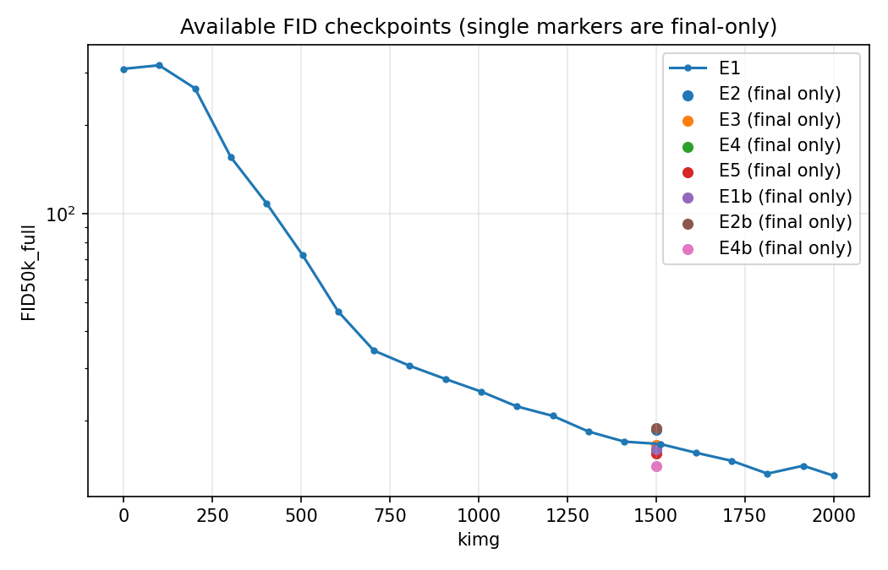
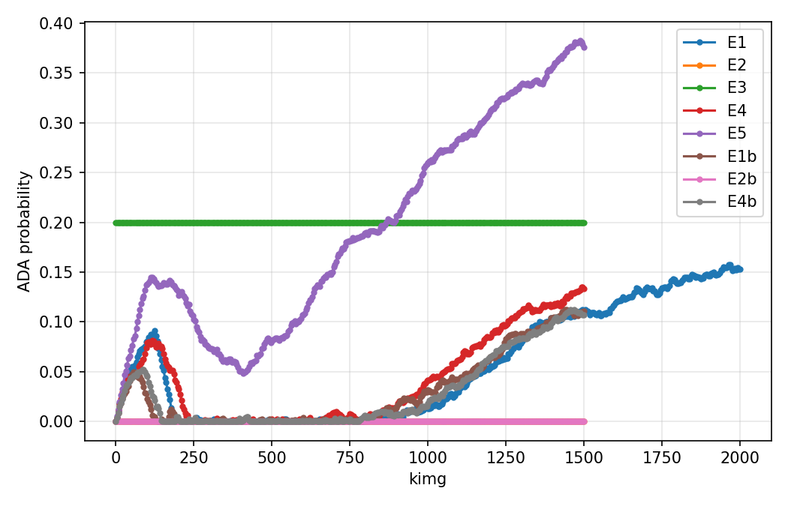
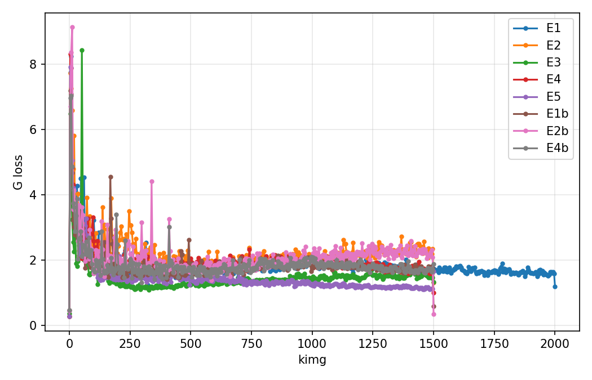
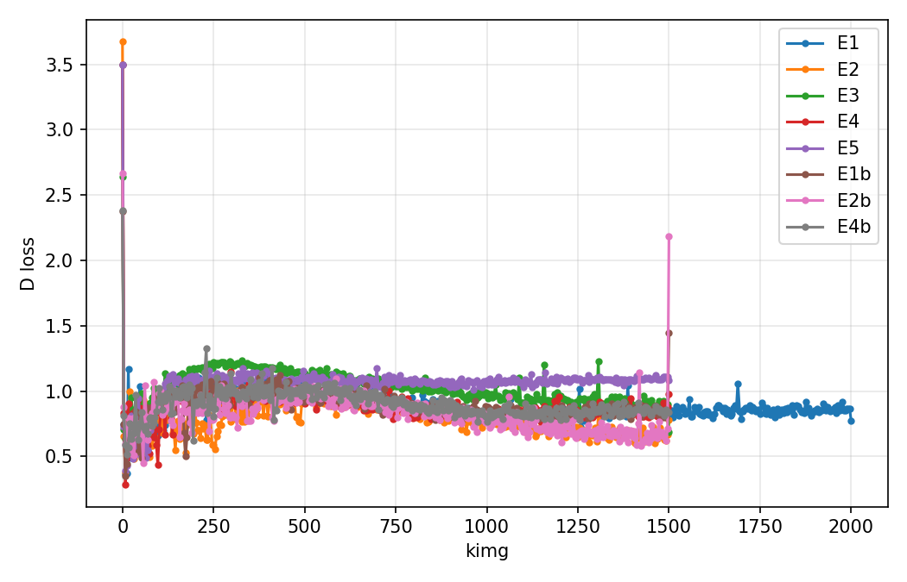
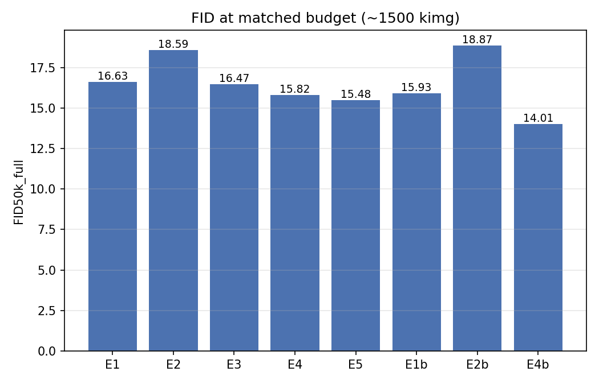
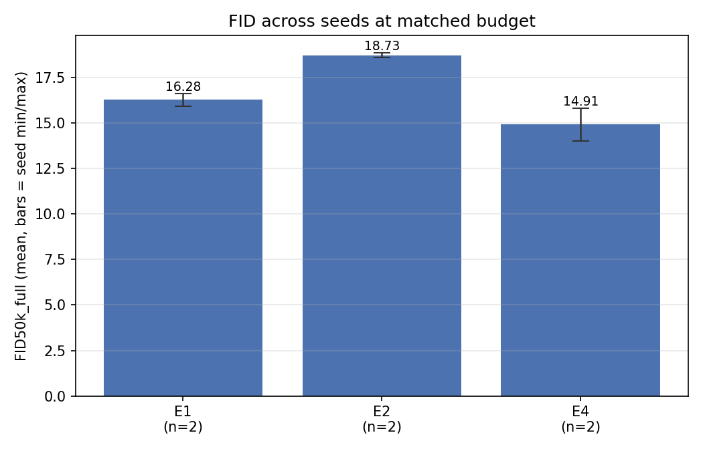
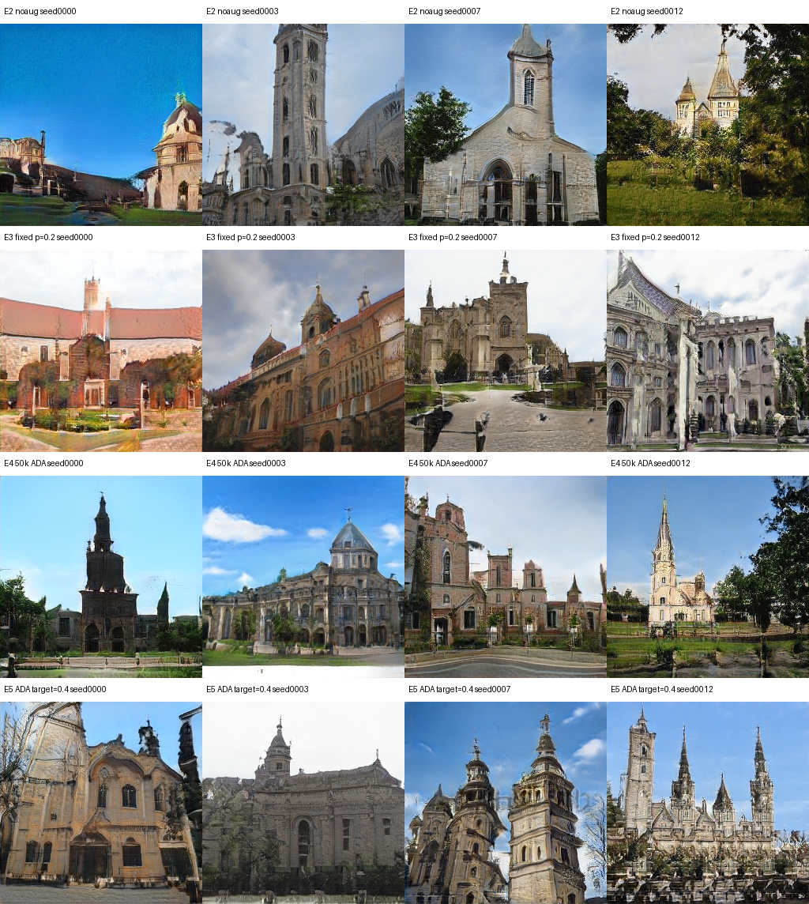
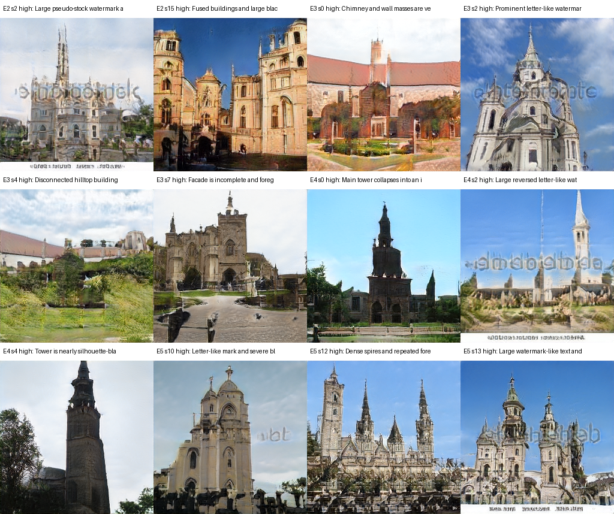
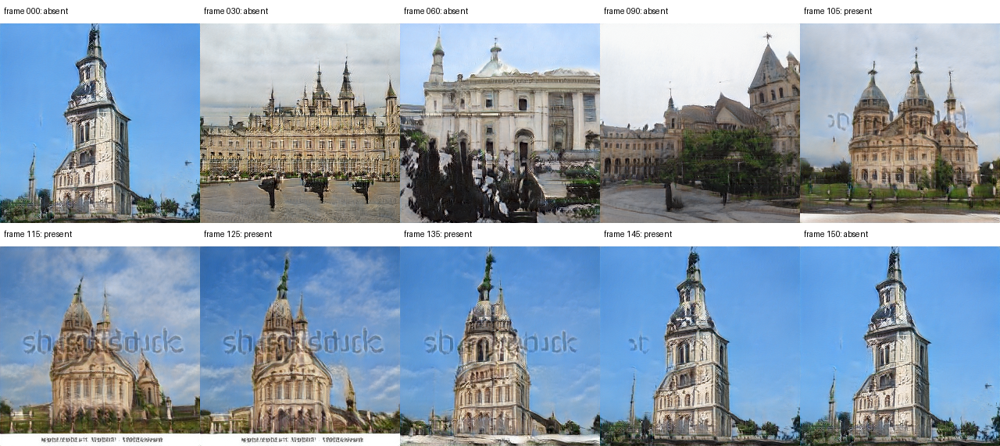

# StyleGAN2-ADA的增强策略与生成性能：基于LSUN Church Outdoor的受控实验

**课程设计最终报告**

| 项目 | 信息 |
|---|---|
| 学生姓名 | 待填写 |
| 学号 | 待填写 |
| 专业与班级 | 待填写 |
| 课程名称 | 机器学习与深度学习 |
| 指导教师 | 待填写 |
| 提交日期 | 待填写 |

# 摘要

本研究构建了一套面向有限数据生成实验的分级、可审计评价流程，以避免用单次 FID 直接判定模型优劣。研究基于 LSUN Church Outdoor 256×256 数据和固定 StyleGAN2-ADA 后端，在约 1500 kimg 统一曝光预算下比较 noaug、固定 p=0.2 与 ADA，并进一步检验 50k/100k 数据规模和 ADA target=0.4/0.6。评价体系以配置驱动的可复现训练流程为基础，将 FID、KID、Precision、Recall、训练轨迹、人工失败标注、水印插值和最近邻检索整合为同一证据链，使定量指标与定性审计相互补充。结果显示，ADA 相对 noaug 的 FID 优势在两个随机条件中方向一致，且平均 Recall 更高；固定增强虽然具有较高 Precision，却伴随最低 Recall。50k 条件取得有竞争力的分布指标，但更多等效轮次和不同子集使其不能被解释为"少数据更优"；target=0.4 的最低单种子 FID/KID 同样需要重复验证。生成样本和潜空间轨迹中的水印说明模型学习了数据污染，而 8 样本最近邻审计未见近像素复制，尚不足以排除总体记忆。本研究的价值在于明确区分重复支持、受限观察与探索性结果，为课程复现中的参数比较和风险表述提供可复用范式。

**关键词：** StyleGAN2-ADA；生成对抗网络；自适应判别器增强；有限数据；图像生成；LSUN Church Outdoor

# 目录

1. 引言
2. 研究方法
3. 实验与结果分析
4. 结论
5. 参考文献
6. 附录

# 1 引言

高分辨率生成模型能够合成具有完整场景结构和局部纹理的图像，但这并不意味着模型真正学到了目标数据分布。在图像生成领域，模型"能够输出清晰图像"与"忠实覆盖真实分布"是两个不同的判断，需要不同的证据支持。生成对抗网络通过生成器与判别器之间的对抗博弈学习数据分布（Goodfellow et al., 2014），其训练过程同时受到网络结构、数据规模和判别器学习状态的影响。当训练数据有限时，判别器可能在短时间内记住训练集中的全部样本，使其区分真实与生成样本的依据逐渐从语义特征退化为对训练集的索引式匹配；此时生成器从判别器获得的梯度反馈也随之失去有效性，即使最终输出的图像在视觉上看似清晰，模型也可能只覆盖少量模式，或将训练数据中的水印等污染特征当作正常内容加以复现。由此，有限数据条件下的图像生成不仅是"能否生成"的问题，更涉及增强策略、评价口径和证据边界是否足以支持对模型质量与多样性的判断。

StyleGAN 通过映射网络、逐层风格调制和随机噪声注入提升了高分辨率图像的可控生成能力（Karras et al., 2019）。映射网络将标准正态分布的输入潜变量变换为语义上更解耦的中间潜空间，逐层风格调制则让不同尺度的结构特征在生成器各层独立受控，从而使粗粒度布局与细粒度纹理在训练与推理时均可分别操纵。StyleGAN2 进一步通过权重调制与解调、路径长度正则等设计改善了结构伪影和训练质量（Karras et al., 2020a），去除了渐进式生长的依赖，并使生成器从输入潜变量到输出图像的映射在局部更接近等距，潜空间插值因而更平滑。在此基础上，StyleGAN2-ADA 针对有限数据下的判别器过拟合，提出依据训练状态自适应调节增强概率的机制（Karras et al., 2020b）；DiffAugment 则从可微增强角度提供了另一种数据高效训练路径（Zhao et al., 2020）。这些研究已经说明增强能够缓解有限数据 GAN 的训练困难，但其结论并不会直接给出具体场景中的实验选择：关闭增强、固定增强概率和自适应增强可能形成不同的质量—覆盖权衡；改变数据规模时，固定 kimg 预算又会同步改变等效训练轮数；ADA target 的单次最优结果也可能受随机条件影响。

现有复现与课程实验容易在三个方面留下解释缺口。第一，不同实验若使用不同训练预算、不同真实数据分布或不同评估翻转设置，指标排名难以归因于被考察因素，即使某个参数配置在表格上排名靠前，也可能只是因为评价协议上的不一致。第二，FID 虽能概括 Inception 特征分布差异（Heusel et al., 2017），却不能独立区分样本逼真度与分布覆盖：一个聚焦于少数高质量模式的模型与一个广泛覆盖训练分布的模型，可能在 FID 上非常接近，但其实际应用价值截然不同；Precision/Recall 正是为拆分这两个维度而提出（Kynkäänniemi et al., 2019）。第三，较低的分布距离既不能证明模型没有记忆训练样本，也不能排除数据污染被学习，因为生成模型在"忠实复现训练分布"的同时，也会复现训练数据中本不应出现在输出中的特征。因而，只复现一个官方配置、展示若干样本或报告单个 FID，仍不足以回答有限数据下增强策略是否有效，以及这种有效性在多大范围内成立。

针对上述问题，本项目在 LSUN Church Outdoor 256×256 图像域中，以固定版本的 StyleGAN2-ADA 为后端，围绕 100k、ADA target=0.6 的中心基线构建一因素变化矩阵，比较 noaug、fixed p=0.2 和 ADA，并进一步考察 50k/100k 数据规模及 target=0.4/0.6。选择 LSUN Church Outdoor 是因为该类别提供了数量充足的场景图像，使得在不同子集规模下均可进行有意义的比较，同时场景图像在视觉上包含可被人工审计的结构特征（建筑轮廓、天际线、植被），便于定性分析。公平比较统一在约 1500 kimg 图像曝光预算下进行，正式评价统一使用完整 100k 真实分布、单卡和 `mirror=false`。对于 ADA 开关和数据规模两条关键轴，项目增加第二随机条件，并将 FID、KID、Precision、Recall、训练动态、固定种子样本、水印轨迹和最近邻审计纳入同一证据链。

本研究的问题可以表述为：**在 LSUN Church Outdoor 的有限数据条件下，数据增强策略、数据规模和 ADA target 如何影响 StyleGAN2-ADA 的生成质量、分布覆盖与训练行为？**

本项目的贡献主要体现在两方面。其一，在一致后端、预算和评价分布下重新组织增强策略比较，结果显示 ADA 相对 noaug 的 FID 改善在两个保留随机条件下排序一致，从而为"自适应增强是否优于无增强"提供了有边界的重复证据；同时，固定增强表现出的高 Precision、低 Recall，以及 target=0.4 的单条件优势均被限定为探索性观察，而非普遍最优结论。其二，项目将定量指标与失败案例、水印审计、潜空间插值和训练集最近邻结合，使"生成质量改善""数据污染复现"和"训练样本记忆"成为相互区分的判断，而不是被单一 FID 数字混在一起。该贡献不在于提出新的 GAN 结构，而在于建立一套可复现、可审计且不越过证据强度的课程实验范式。

本章其余部分梳理 GAN、StyleGAN2、有限数据增强和生成模型评价的相关工作；第二章说明研究方法，涵盖数据、模型配置、因素矩阵与评价方法；第三章从训练动态、定量指标、定性样本、污染特征和最近邻审计展开实验结果与分析；第四章总结主要发现、讨论研究局限并提出后续工作方向。

## 1.1 生成对抗网络及其训练问题

生成对抗网络通过生成器与判别器之间的两方博弈学习数据分布。生成器将潜变量映射为合成样本，判别器则区分真实样本与生成样本；二者在交替优化中形成对抗目标（Goodfellow et al., 2014）。这一框架摆脱了显式似然建模的部分限制——无需对真实分布作出参数化假设，只需通过对抗信号迭代引导生成器靠近真实分布——但其训练过程并不等同于一般监督学习。

GAN 训练的一个关键困难在于判别器与生成器的学习速率失衡。当两个分布的支撑集缺少充分重叠时，判别器可能以接近完美的准确率区分真实与生成样本，此时其反传梯度几乎消失，生成器无法从中获得有效更新方向，训练陷入停滞或振荡。另一类常见失效是模式崩溃：生成器发现将输出集中于少数高分的样本可以"欺骗"判别器，因此放弃覆盖训练分布的多样性，导致生成结果在语义和视觉上高度同质。早期研究因此将模式崩溃、训练振荡和评价困难视为 GAN 的核心问题，而不仅是网络容量不足。

围绕训练稳定性的研究逐渐从经验技巧转向距离度量和优化机制。Wasserstein GAN 以 Wasserstein 距离重构训练目标，使损失曲线具有更明确的诊断意义：Wasserstein 距离在两个分布支撑集不重叠时仍能提供有意义的梯度，从而在一定程度上缓解模式崩溃与训练不稳定（Arjovsky et al., 2017）。这一方向说明，生成质量不仅取决于更深的网络，也取决于判别信号是否能在训练全过程中提供有效梯度。不过，WGAN 并未消除有限数据带来的判别器记忆，也不能单独解决高分辨率图像中多尺度结构和局部纹理的协调生成问题。后续 StyleGAN 系列的贡献，正是在训练策略、生成器结构和潜空间控制三个层面进一步推进高质量无条件图像生成。

## 1.2 从渐进式生成到 StyleGAN2

高分辨率 GAN 的一条重要技术路线是逐步增加训练分辨率。Karras et al. (2018) 提出渐进式生长，使生成器和判别器从低分辨率开始训练，再逐层加入高分辨率模块，以较稳定的方式学习由整体布局到局部细节的层级结构。该方法改善了高分辨率生成的训练效率和稳定性，但网络表示仍主要沿用传统潜变量到图像的直接映射，潜空间中的语义因素缺乏显式的尺度化控制，导致改变潜变量时往往引发多个属性同时变化，可控性受限。

StyleGAN 将风格迁移思想引入生成器，使用映射网络将输入潜变量映射到中间潜空间，并通过逐层风格调制控制不同尺度的合成特征，同时以噪声注入表达随机细节（Karras et al., 2019）。映射网络的引入使中间潜空间比原始输入空间更接近"解耦"——不同语义属性在空间中的分布更为均匀，改变某一方向时对其他属性的影响更小。这种设计提升了潜空间插值和尺度特定控制能力，使姿态、整体结构、纹理与随机细节能够在不同层级上被独立分析。StyleGAN2 进一步指出原始归一化设计会引入特征伪影，因此采用权重调制与解调重构生成模块，其本质是将实例归一化从激活值挪到权重上，避免了伪影来源，同时取消对渐进式生长的依赖，并引入路径长度正则以改善潜变量到图像映射的条件性（Karras et al., 2020a）。路径长度正则的作用在于约束潜空间中的单位移动在图像空间中引起近似等幅的变化，使插值轨迹更平稳且语义上更可预测。由此，StyleGAN 的演进并非单纯扩大模型，而是逐步将生成质量、潜空间可控性与结构伪影治理纳入统一架构。

国内相关工作更多集中在面向具体图像域的生成与改进。例如，李海军等（2022）将 StyleGAN 用于红外舰船图像生成，秦魁等（2023）和李冰等（2021）则分别研究火焰图像和红外图像的 GAN 生成。这些研究说明，生成对抗网络已从通用自然图像扩展到目标稀缺或采集成本较高的专业图像域。不过，此类应用研究通常围绕特定任务修改网络或损失，其数据分布、评价目标和监督条件与 LSUN 场景无条件生成并不相同。因此，它们适合用于说明国内应用脉络，却不能替代 StyleGAN、StyleGAN2 原始论文对核心结构和作用机制的定义。

## 1.3 有限数据条件下的增强策略

当训练样本不足时，GAN 的主要风险并非生成器简单"看得少"，而是判别器能够记住训练集，使真实与生成样本之间的分类任务迅速失衡。具体而言，判别器在有限数据条件下容易将训练样本对应的特征子空间与"真实"标签紧密捆绑，而非学习数据分布的统计规律；生成器一旦产生训练集之外的新颖样本，就会被判别器识别为"假"并接受惩罚，从而被迫向训练集的少数记忆模式靠拢。

StyleGAN2-ADA 针对这一问题提出自适应判别器增强：对进入判别器的真实图像和生成图像施加同一组可逆或近似非泄漏变换，并依据判别器过拟合信号动态调整增强概率（Karras et al., 2020b）。所谓"非泄漏"，是指所施加的变换不会改变判别器面对的真实与生成样本的相对关系——若只对真实样本增强，判别器可能将增强变换本身视为"真实"的判别依据，造成增强信息泄漏到生成器目标中。ADA 的控制逻辑以判别器在训练集上的过拟合程度为反馈信号，当判别器过早饱和时提升增强概率，增加分类任务难度；当过拟合程度下降时降低概率，避免增强过强干扰学习。其关键不在于扩充一个固定的新数据集，而在于动态控制判别器所见分布的难度，同时避免生成器学习增强变换本身。原论文显示，该机制可在仅有数千张图像时显著改善训练稳定性，但增强管线、目标值和数据规模仍构成需要结合任务检验的边界条件。

与 ADA 并行的 DiffAugment 将可微增强同时作用于真实和生成样本，并让梯度通过增强操作回传，从而以较简洁的方式提高多种 GAN 架构的数据效率（Zhao et al., 2020）。两者都反对只增强真实样本，因为单侧增强可能改变判别器面对的真实分布并造成增强泄漏；区别在于 ADA 强调根据训练状态自适应调节增强强度，而 DiffAugment 更强调端到端可微变换，两者适用的场景和设计哲学并不完全相同。因而，"是否增强""采用固定概率还是自适应概率"以及"自适应目标如何设置"并非等价选择，需要在统一预算和评价口径下比较。

中文研究也表明 GAN 可被用于样本扩充。张印等（2024）将条件对抗生成网络用于模式识别数据增强，孟奇等（2021）面向镜片缺陷构建双通道 GAN 数据增强方法。另一些工作把 GAN 用于水下图像增强和医学图像超分辨率重建（林森、刘世本，2021；宋巍等，2021；柯舒婷等，2022）。这些成果支持生成模型能够服务于有限样本和图像质量改善，但其"生成额外训练样本"或"图像到图像重建"范式不同于 ADA 对判别器输入实施在线增强。若不区分这些机制，容易把生成式数据扩充、图像增强和判别器正则化混为同一方法类别，从而对文献的适用范围产生误判。

## 1.4 生成模型评价及其解释边界

GAN 评价需要同时处理样本逼真度与分布覆盖。FID 在预训练 Inception 特征空间中，以高斯近似比较真实和生成样本的均值与协方差，是当前最常用的分布距离指标之一（Heusel et al., 2017）。FID 的优点是对全局分布差异敏感，能够在单一数值上综合反映模型质量；但其高斯假设在真实图像分布上并不严格成立，且 Inception 特征提取器是在 ImageNet 上预训练的，对特定图像域（如建筑场景）的特征区分能力可能与人类视觉感知存在偏差。KID 同样基于 Inception 特征，但使用核最大均值差异并提供无偏估计，为有限样本评价提供了不同的统计视角（Bińkowski et al., 2018）。二者都将复杂图像映射到特征空间后比较分布，因此更低的 FID 或 KID 通常表示整体匹配更好，却不能直接证明模型没有记忆训练样本，也不能独立定位质量提升究竟来自更高逼真度还是更广覆盖。

为拆分这两个维度，Kynkäänniemi 等（2019）提出改进的 Precision/Recall 指标：Precision 刻画生成样本落入真实数据流形的比例，即每个生成样本在 Inception 特征空间中是否有真实样本作为邻居；Recall 则刻画真实数据流形被生成分布覆盖的程度，即每个真实样本在特征空间中是否有生成样本作为邻居。这一区分的实践意义在于：若模型将生成分布收缩到训练集中最容易复现的少数高频模式，Precision 可能维持较高，但 Recall 会明显下降，表明模型的分布覆盖能力不足。该区分对于分析固定增强概率尤其重要，因为模型可能通过收缩到少数高质量模式获得较高 Precision，同时牺牲 Recall。故单一指标排序不应被直接解释为全面优越，定量指标还需结合固定随机种子样本、潜空间插值和最近邻审计等定性手段。

本项目使用的 LSUN 数据集由半自动的人机协同标注流程构建，覆盖大规模场景和物体类别；其中每个场景类别约有百万级标注图像（Yu et al., 2015）。大规模原始数据为场景生成提供了基础，但具体实验所使用的 50k 或 100k 子集、训练图像曝光预算以及数据中的水印等污染特征，仍会改变实际学习条件。因此，数据集规模不应只以样本数量描述，还应同时报告子集构造、重复曝光次数、训练预算和数据溯源限制，以便读者判断实验结论的适用范围。

## 1.5 研究空白与本项目定位

现有研究已经分别建立了 StyleGAN2 的结构基础、ADA 与 DiffAugment 的有限数据训练方案，以及 FID、KID 和 Precision/Recall 的评价工具，但这些贡献并不会自动给出特定课程复现实验中的参数选择结论。尤其是在固定图像曝光预算下，数据规模变化会同步改变等效训练轮数；固定增强概率可能在样本逼真度和分布覆盖之间形成不同权衡；ADA target 的影响也可能受随机条件限制，仅凭单次实验无法确认排序的稳定性。若只复现单个官方配置或只报告 FID，这些因素之间的相互作用将难以被识别。

基于这一缺口，本项目在 LSUN Church Outdoor 256×256 场景上，以统一 StyleGAN2-ADA 后端比较 noaug、固定增强和 ADA，并进一步考察 50k/100k 数据规模及不同 ADA target。评价同时覆盖 FID、KID、Precision、Recall、训练动态、定性样本、水印轨迹和最近邻审计。项目不试图提出新的 GAN 架构，也不把有限随机条件结果推广为普遍规律；其贡献在于把已有方法置于一致的工程环境和证据链中，明确哪些结论得到重复条件支持，哪些只能作为探索性观察，从而为类似的课程复现实验提供一套可参考的评价范式。

# 2 研究方法

## 2.1 研究设计

本项目采用受控计算实验与复现性工程相结合的研究设计，研究对象是 StyleGAN2-ADA 在 LSUN Church Outdoor 图像域中的训练与生成行为。研究问题聚焦三个可操作因素：数据增强策略、训练数据规模和 ADA target，并考察它们对生成质量、分布覆盖与训练动态的影响。实验以统一后端、统一训练预算和统一评估分布构建一因素变化矩阵，在课程预算内形成明确对照，同时避免全因子组合造成的训练成本膨胀。

选择单因素变化矩阵而非全因子设计，有两方面原因：一是在课程预算约束下，全因子组合（三种增强方式 × 两种数据规模 × 两种 target × 两个随机种子）将产生远超可执行数量的 run；二是单因素变化在解释实验结果时更为清晰，每个对照的差异可明确归因于被操控的单一变量，而全因子设计若不伴随充分重复，多因素交互效应同样无法可靠估计。

实验以 100k 数据、ADA target=0.6 为中心基线。主矩阵 E1-E5 均使用训练随机种子 42，分别改变增强方式、数据规模或 ADA target；随后对最关键的 ADA 开关轴和数据规模轴增加 seed=1 的 E1b、E2b、E4b 重复条件。之所以优先为这两条轴增加重复，是因为"是否使用 ADA"和"数据规模如何影响结果"是研究问题中最核心的两个方向，而 fixed p=0.2 和 target=0.4 的价值更偏向探索性，在有限预算下优先级较低。最终形成 8 个正式实验条件。E6（target=0.8）因其边际价值低且预算有限未执行，不纳入结果比较。

## 2.2 计算后端与运行环境

模型后端采用 NVIDIA `stylegan2-ada-pytorch`，固定上游提交 `d72cc7d041b42ec8e806021a205ed9349f87c6a4`。本项目没有把"实现"表述为从零重写 StyleGAN2 网络，而是以可核验的官方实现为模型基础，完成面向课程实验的工程实现、环境适配和受控验证。固定提交哈希的意义在于使后端代码在任何时间点均可被独立核验，避免上游仓库更新引入静默的行为变化。统一入口 `scripts/run_experiment.py` 读取 JSON 配置，再由 `src/stylegan_course/commands.py` 构造后端的训练、生成与评价命令。由此，实验变量被显式保存在配置文件中，避免手工拼接命令造成不可追踪的参数差异。

### 2.2.1 个人实现内容与改进边界

个人完成的实现包括：固定后端版本并编写五类兼容补丁；建立配置驱动的训练、权重热启动、生成和离线评价入口；实现数据转换与校验、环境预检、结果汇总、潜空间插值和最近邻检索；设计 E1-E5 因素矩阵与第二随机条件；建立指标、人工标注、数据溯源和允许表述之间的证据链。这些工作共同构成本课程项目的可复现实验系统，而不是对上游命令的简单调用。

课程要求中的"参数调优与尝试改进"主要对应两类工作：一是比较 noaug、固定增强和 ADA，并调整 ADA target 与数据规模，分析生成质量和覆盖的变化；二是把单次 FID 评价扩展为 FID、KID、Precision/Recall、失败案例、水印轨迹和最近邻审计相结合的分级评价流程。前者属于训练策略与参数层面的改进尝试，后者属于评价与复现流程改进。本项目不宣称提出新的网络结构或新的 GAN 算法。

目标训练环境为 Ubuntu 22.04、Python 3.12、PyTorch 2.8.0+cu128、CUDA 12.8 和 NumPy 2.x。为使原始后端在现代环境中运行，项目应用了五类兼容修改：（1）PyTorch 2.x 中部分算子接口与采样器行为发生变化，需要适配调用方式；（2）Pillow 新版本对某些图像读写接口有不兼容调整；（3）Python 3.12 移除了标准库中的 `distutils` 模块，而后端代码依赖该模块进行编译检测；（4）多卡训练时快照一致性检查的进程同步逻辑需要调整；（5）NumPy scalar 在 NumPy 2.x 中的行为发生了变化，影响部分数值转换操作。这五类补丁均不改变模型的网络结构、损失函数或训练目标，其唯一作用是恢复固定后端在当前软硬件环境中的可执行性。

每个正式训练 run 使用 2 张 GPU。四卡机器用于同时调度两个独立的双卡 run，六卡机器用于同时调度三个独立的双卡 run，不能将其描述为单模型四卡或六卡训练。正式 FID、KID 和 Precision/Recall 评估统一使用单卡，因为 PyTorch 2.8 环境下双卡 `pr50k3_full` 在进程组收尾阶段可能发生 NCCL/TCPStore 错误，导致评价结果不完整或进程挂起。

## 2.3 数据集与预处理

正式数据为 LSUN Church Outdoor 训练集。原始数据以 LMDB 形式保存，经 NVIDIA 数据工具按中心裁剪方式转换为 256×256 RGB 图像，并封装为无类别标签的 ZIP 数据集。选择中心裁剪而非随机裁剪，是为了在所有实验条件中保持数据预处理方式完全一致，避免引入额外的随机性来源。正式转换文件包含 100,000 张图像及一个 `dataset.json`，抽样检查的 32 张图像均为 256×256 RGB。文件大小为 19,712,169,438 字节，SHA-256 为 `0bef00af2e08661b1b76b17576863287a5403f71f6fc5ba58a7a3bbd225bc25d`。

训练阶段所有条件均启用水平翻转，即配置中的 `mirror=true`。水平翻转在建筑场景图像上通常是合理的数据增强，因为建筑构图在水平方向上大体对称，翻转后的图像仍属于同一语义域。因此 E2 的 `noaug` 仅表示关闭 StyleGAN2-ADA 在线增强管线，不表示完全没有任何数据层面的翻转。E4 和 E4b 从同一 100k ZIP 中确定性选取 50,000 张训练图像；由于训练 seed 同时参与子集选择，两次 50k 条件既改变模型随机性，也改变实际子集，不能视为只改变初始化的纯种子重复。这一混杂是在课程预算约束下不可避免的设计选择，其影响被显式记录在研究局限中。

目标机 shell 历史未保留，实际下载来源与下载日期无法恢复。项目仅把 LSUN 官方页面和公开镜像记录为计划来源，不将文件修改时间冒充下载时间。该限制被保留在数据溯源记录中，不影响已验证的图像数量、分辨率、结构和哈希事实。

## 2.4 模型配置与训练过程

所有正式条件采用上游 `paper256`、无条件生成设置。基线实际训练配置使用 512 维 Z 空间、512 维 W 空间和 8 层映射网络；生成器和判别器优化器均为 Adam，学习率为 0.0025，beta 为 (0, 0.99)，R1 正则系数为 1，全局 batch size 为 64，指数移动平均时间常数为 20 kimg。除实验因素外，各对照组继承相同的 `paper256` 设置，确保网络容量、优化超参数和正则化强度在组间完全一致。

ADA 与 fixed 条件使用 `bgc` 增强管线，覆盖像素级搬移（blitting）、几何变换（geometry）和颜色变换（color）。该管线涵盖了平移、旋转、缩放、翻转、亮度/对比度调整、色彩抖动等多类操作，在视觉上足够丰富以提高判别任务难度，同时保持变换的可逆性以避免泄漏。E1、E4 使用 ADA target=0.6，E5 使用 target=0.4；E3 使用固定增强概率 p=0.2；E2 关闭 ADA 管线。ADA 根据判别器过拟合统计动态调节增强概率，fixed 条件则在训练期间保持 p=0.2 不变。target 参数定义了 ADA 控制器的过拟合信号目标值：target 越低，控制器容忍的过拟合程度越小，倾向于维持更高的增强概率。

训练预算以 kimg 表示，即模型累计处理的图像数量。公平比较点统一设为约 1500 kimg。E2-E5 和 E1b/E2b/E4b 均训练至 1500 kimg；E1 原基线训练至 2000 kimg，公平比较时使用最接近预算点的 1512 kimg 快照。E1 的 2000 kimg 模型仅用于最终生成展示、完整训练曲线和潜空间分析，不参与 1500 kimg 排名。采用固定图像曝光预算意味着 50k 条件相对 100k 条件经历更多重复曝光——在相同的 1500 kimg 下，50k 数据集的每张图像被模型看到的次数约为 100k 数据集的两倍——因此数据规模比较只能解释为"固定 kimg 条件下的表现"，不能推断更少数据天然更优。

## 2.5 实验矩阵与控制变量

增强策略轴由 E1、E2、E3 构成：E1 为 100k、ADA target=0.6；E2 为 100k、noaug；E3 为 100k、fixed p=0.2。数据规模轴比较 E1 与 E4，其中 E4 使用 50k、ADA target=0.6。参数敏感性轴比较 E1 与 E5，其中 E5 使用 100k、ADA target=0.4。除被考察因素外，分辨率、网络配置、训练 seed、训练用卡数、训练预算和评价分布保持一致。各实验条件与控制变量的关系如下表所示。

**表 2-1　实验矩阵**

| 实验 | 数据 | 增强 | ADA target | seed | 重复条件 | 结论层级 |
|---|---|---|---|---|---|---|
| E1 | 100k | ADA | 0.6 | 42 | E1b(seed=1) | 有限重复支持 |
| E2 | 100k | noaug | — | 42 | E2b(seed=1) | 有限重复支持 |
| E3 | 100k | fixed p=0.2 | — | 42 | 无 | 探索性 |
| E4 | 50k | ADA | 0.6 | 42 | E4b(seed=1) | 有边界重复观察 |
| E5 | 100k | ADA | 0.4 | 42 | 无 | 探索性 |

重复条件 E1b、E2b、E4b 使用 seed=1，并维持 1500 kimg 与相同评价口径。E1/E1b 和 E2/E2b 可用于观察 ADA 开关在两种随机条件下的排序是否一致，其重要性在于：如果两个种子中 ADA 均优于 noaug，则这一结论具有初步的跨随机条件稳定性；若两个种子中结论方向不一致，则单种子结果的可靠性受到质疑。E4/E4b 同时包含模型随机性和 50k 子集差异，因此只作为不同随机性与不同子集下的重复条件，而非严格的纯重复。E3 与 E5 未设置第二随机条件，相关发现被预先限定为探索性结果，不作统计显著性或普遍最优声明。

## 2.6 定量评价

训练完成后，使用后端官方 `calc_metrics.py` 离线计算 `fid50k_full`、`kid50k_full` 和 `pr50k3_full`。所有正式评价均设置 `gpus=1`、`mirror=false`，并以完整 100k 原始分布为真实数据参照；50k 模型也对完整 100k 分布评价，而非只对其训练子集评价，以保证组间口径一致。若允许 50k 模型只对自身训练子集评价，则分布估计的参照不同，组间对比将失去意义。FID 与 KID 用于衡量 Inception 特征分布的整体差异，Precision 和 Recall 分别辅助分析样本保真度与真实分布覆盖。任何结论均不只依赖 FID。

分析脚本读取各 run 的 `stats.jsonl` 和 `metric-*.jsonl`，提取 FID、KID、Precision、Recall、ADA 概率、生成器与判别器损失、每 kimg 耗时、墙钟时间，以及各训练区间记录的单卡 CUDA 显存峰值。由于后端在每个 tick 后重置峰值统计，汇总时分别保留所有区间中的最大值和末段区间值，避免把末段值误写为全程峰值。若同一快照存在重复评价，保留时间戳最新的有效记录，同时记录评价次数。跨随机条件只报告均值、最小值、最大值和范围；由于每组仅有两个保留条件，不进行显著性检验，也不把范围误写为置信区间。

## 2.7 定性分析与记忆风险审计

定性分析包括固定随机种子样本、W 空间插值、失败案例、水印审计和训练集最近邻。E2-E5 各选取 16 张固定 seed 样本，共 64 张，按建筑结构、场景布局、纹理、物体伪影、水印和多样性问题进行完整标注。使用固定 seed 是为了让每个模型的取样过程可复现，便于在同一展示框架下观察各条件的视觉特征；但不同模型独立训练，其潜空间并不对齐，因此相同 seed 值对应的生成内容不具有语义配对关系，不能把同 seed 图像的差异解释为因果对比。另对 88 张相互独立的生成样本进行水印标注，其中 8 张确认为存在水印类文字、1 张标记为疑似；对 E1 的 151 帧插值轨迹另行审计，其中 46 帧确认为存在、2 帧为疑似。由于插值帧彼此相关，两类样本不合并计算发生率。

W 空间（而非 Z 空间）插值的选择有其理由：W 空间经过映射网络变换，在局部上更接近线性解耦，插值轨迹更倾向于产生语义连续的过渡，而 Z 空间的直线插值可能经过低概率区域，产生视觉上不连贯的中间帧。在 W 空间中连续插值并审计水印出现位置，能够揭示水印是否已成为生成表示中可插值的连续属性，而非孤立出现的随机噪声。

最近邻审计使用与 FID 相同的官方 Inception 特征提取器。对 E1 最终模型的 seed 0-7 共 8 个生成样本提取 2048 维特征，逐张扫描完整训练集，在关闭真实集翻转的条件下计算 L2 距离，并为每个生成样本保存 Top-3 训练集近邻，共形成 24 条记录。使用与 FID 相同的特征空间，是为了使最近邻检索与分布指标保持方法上的一致性；在该空间中距离接近的图像对，理论上也是 FID 认为分布接近的图像对。该审计只能发现当前样本在这一特征空间中的近邻关系，不能排除在其他特征空间或更大样本量下存在的记忆现象。

## 2.8 可复现性与质量控制

项目在训练前执行环境预检、配置解析和后端 dry-run。非 GPU 测试共 28 项，覆盖命令构造、配置约束、数据校验和分析逻辑；25 个项目 Python 文件通过 AST 解析，11 份 JSON 配置可解析。测试同时断言正式评价使用单卡且 `mirror=false`，从流程上防止评价协议的意外变更。`scripts/build_evidence.py` 从原始指标、训练日志、配置、人工标注和近邻结果重建实验清单与结论边界，并检查 8 个正式条件的关键字段，确保每条声明都能追溯到具体来源文件。

研究质量从四个方面控制：第一，内部可比性通过统一后端、预算、分辨率和评价分布实现；第二，构念效度通过 FID、KID、Precision、Recall 与定性证据的多方法结合提高；第三，可重复性通过固定配置、seed、数据哈希和自动分析脚本保障；第四，可审计性通过实验清单、原始来源路径和"允许表述—限制条件"矩阵建立。该设计不能消除有限随机条件、50k 子集混杂和未保留附件造成的不确定性，因此所有结论按"重复条件支持""有边界的重复观察"或"单条件探索"分级报告。

## 2.9 伦理与数据使用说明

本项目不涉及人体受试者、访谈、个人身份识别或干预实验，因此不适用知情同意和受访者匿名化程序。所用 LSUN Church Outdoor 主要为公共场景图像，相比人脸数据集具有较低的身份隐私风险。但数据中的图库水印和来源不完全可恢复仍构成数据治理问题，故项目不将生成水印作为模型能力，并在报告中明确数据污染、来源记录和使用边界。

# 3 实验与结果分析

本章按照"训练过程—增强策略—数据规模—增强强度—视觉失效—污染与记忆审计"的顺序呈现实验结果。除特别说明外，核心横向比较均采用约 1500 kimg 的公平预算点；E1 的公平点为 1512 kimg，其余主实验为 1500 kimg。由于完整重复实验仅覆盖 E1、E2 和 E4，本文只在这三个条件上讨论跨种子稳定性，不对单种子结果作统计显著性推断。

## 3.1 基线训练：ADA 的启动与非单调收敛

E1（100k 数据、ADA、目标值 0.6）提供了本研究最完整的训练轨迹。训练早期的 FID 很高：0 kimg 时为 309.22，100 kimg 时为 317.93，表明模型尚未形成稳定的图像分布，这一阶段的指标波动属于正常的探索期，不宜用于条件优劣判断。

ADA 概率的变化轨迹揭示了控制器的工作机制。在训练初段，ADA 概率基本保持为零：0 kimg 时为 0，500 kimg 时仅为 0.0010，1000 kimg 时为 0.0133。这意味着在训练的前半程，判别器的过拟合程度尚未触发控制器的干预阈值——判别器虽然在学习，但在这一阶段其过拟合信号还未显著超出目标值，控制器因而维持较低的增强强度。此后增幅明显加快，1500 kimg 达到 0.1096，2000 kimg 达到 0.1531。这种"先观望、后介入"的动态表明，ADA 并非在训练一开始就施加干扰，而是在判别器逐渐表现出过拟合倾向后才被控制器持续推高增强概率，与原论文中描述的自适应反馈机制一致。



*图 3-1　各实验条件的 FID 变化。仅 E1 有完整训练轨迹，其余为终点评价。*



*图 3-2　各实验条件的 ADA 增强概率轨迹。E2/E2b（noaug）恒为 0，E3（fixed p=0.2）恒定，ADA 条件按过拟合信号动态调节。*

图 3-3 和图 3-4 给出了所有实验条件的生成器与判别器损失曲线。各条件的损失在训练初期存在不同程度的尖峰波动，随后收敛至相似的范围（生成器损失约 1.2—2.5，判别器损失约 0.6—1.2），表明不同增强配置在训练稳定性方面未产生质变。E5（target=0.4）的生成器损失在中后段略低于其他条件，与其更强的增强压力一致。



*图 3-3　各实验条件的生成器损失变化。*



*图 3-4　各实验条件的判别器损失变化。*

后期 FID 并非单调下降。E1 在 1814 kimg 时的 FID 为 13.21，1915 kimg 时回升至 14.04，2000 kimg 又降至 13.00。这种非单调收敛在 GAN 训练中并不罕见：判别器与生成器之间的动态博弈使训练轨迹本身存在波动，加之 ADA 概率持续变化，某些时刻的快照可能处于两者相对平衡的稳定点，另一些时刻则可能偏离。因此，后续比较采用预先规定的预算点，而不是从每个条件中事后挑选最低 FID，以避免在回顾性最优化中引入选择性偏差。

E1 使用双卡完成 2000 kimg 训练，墙钟时间约 7.35 小时。日志记录的单卡区间显存峰值在初始化区间达到约 17.66 GB，末段区间为约 3.24 GB；二者分别表示全程记录最大值和稳定训练后期的区间值，不能把 3.24 GB 写成整次训练的峰值，也不能据此声称正式实验是单卡训练。

## 3.2 相同预算下的增强策略比较

表 3-1 汇总了主实验在公平预算点的指标。E1 与 E2 仅在是否使用 ADA 上形成最直接的对照。在 seed 42 条件下，E1 的 FID 为 16.63，低于无增强 E2 的 18.59，差值约 2 个单位；KID 也略低；Recall 由 E2 的 0.0283 提高到 E1 的 0.0602，约为两倍；Precision 则由 E2 的 0.5572 提高到 E1 的 0.5887。就单种子结果而言，ADA 在所有四项指标上均不劣于 noaug，且 Recall 的提升幅度最为明显，说明 ADA 对真实分布覆盖的改善效果在本次观察中尤为突出。

**表 3-1　约 1500 kimg 公平预算点的量化指标**

| 实验 | 数据规模 | 增强设置 | FID↓ | KID↓ | Precision↑ | Recall↑ |
|---|---:|---|---:|---:|---:|---:|
| E1 | 100k | ADA，target=0.6 | 16.63 | 0.0111 | 0.5887 | 0.0602 |
| E2 | 100k | 无增强 | 18.59 | 0.0113 | 0.5572 | 0.0283 |
| E3 | 100k | 固定 p=0.2 | 16.47 | 0.0091 | 0.6241 | 0.0263 |
| E4 | 50k | ADA，target=0.6 | 15.82 | 0.0082 | 0.5471 | 0.0367 |
| E5 | 100k | ADA，target=0.4 | 15.48 | 0.0075 | 0.6042 | 0.0300 |



*图 3-5　主实验与重复条件在公平预算点的 FID。*

固定增强 E3 呈现出不同的质量—覆盖权衡。其 FID 为 16.47，与 E1 接近；KID 为 0.0091，且 Precision 0.6241 是五个 seed 42 主实验中最高的，但 Recall 0.0263 是最低的。换言之，固定增强条件下的生成样本倾向于集中于高可信度区域，但没有覆盖更多真实数据模式。这一模式的可能机制是：固定 p=0.2 的增强在训练全程保持不变，对判别器的干扰强度相对稳定，生成器可能因此学会在增强变换的掩护下优先生成判别器最容易接受的高频模式，而放弃对长尾多样性的探索。该现象说明，仅根据 FID 或 Precision 判断增强策略可能掩盖模式覆盖不足。不过，E3 没有第二个种子，因此这一解释只作为当前实验矩阵内的探索性观察。

## 3.3 重复种子：ADA 相对无增强的稳定优势

E1、E2 和 E4 各保留了两个种子的完整指标，为检验单种子结论的方向稳定性提供了基础。E1 的两次 FID 分别为 16.63 和 15.93，均低于 E2 的 18.59 和 18.87；两组观测区间没有重叠，说明在当前两个种子下，ADA 优于 noaug 的排序方向是一致的。按条件聚合后，E1 的平均 FID 为 16.28，E2 为 18.73；E1 的平均 KID 也更低，平均 Recall 为 0.0670，约为 E2 的 0.0346 的两倍，而平均 Precision 差异相对较小（0.5733 vs 0.5581）。

**表 3-2　保留条件的双种子聚合结果**

| 条件 | n | FID 均值 | FID 范围 | KID 均值 | Precision 均值 | Recall 均值 |
|---|---:|---:|---|---:|---:|---:|
| E1：100k + ADA | 2 | 16.28 | 15.93–16.63 | 0.0104 | 0.5733 | 0.0670 |
| E2：100k + 无增强 | 2 | 18.73 | 18.59–18.87 | 0.0118 | 0.5581 | 0.0346 |
| E4：50k + ADA | 2 | 14.91 | 14.01–15.82 | 0.0079 | 0.5376 | 0.0561 |



*图 3-6　E1、E2 与 E4 的双种子 FID（均值与范围）。*

两个种子的结果共同支持一个有限但较稳健的判断：在本项目的 100k 数据、约 1500 kimg 预算和其余配置不变的条件下，ADA 相对无增强改善了 FID，并提高了 Recall。之所以用"有限"限定，是因为每个条件只有两个种子，两个随机条件都支持同一方向并不等同于统计显著性，也不能推断优势在其他数据集、分辨率或训练预算下必然成立。但相比只有单一种子，两个方向一致的结果已经排除了"单次实验恰好偏好某个方向"的偶然性，为后续更大规模重复提供了初始方向参考。

## 3.4 数据规模与增强目标值：更低 FID 不等于一般性最优

E4 将训练集从 100k 减少到 50k，同时保持 ADA target=0.6 和相同 kimg 预算。其两个种子的 FID 为 15.82 和 14.01，均未高于各自配对的 E1；平均 FID 为 14.91，低于 E1 的 16.28。KID 也呈相同方向。然而，E4 的跨种子跨度为 1.80，明显大于 E1 的 0.71，说明在 50k 条件下，随机初始化和子集选择对最终指标的影响更为显著，结果的稳定性弱于 100k 条件。E4 的平均 Precision 为 0.5376，也低于 E1 的 0.5733。

更重要的是，在固定 kimg 下，50k 条件会经历更多等效数据轮次。以 1500 kimg 为预算、batch size 为 64 计算，100k 数据集约被遍历 1500×1000÷100000=15 轮，而 50k 数据集约被遍历 30 轮。更多的重复曝光既可能帮助模型充分学习训练子集的特征，也可能加剧对训练集的过度拟合；ADA 虽然提供了一定程度的保护，但在远超正常等效轮次的情况下，其保护效果是否足够难以从当前数据推断。此外，E4/E4b 的训练 seed 同时决定了 50k 子集的选取，两次重复在样本组成上本身也不同。因此，该结果只能说明"50k 条件在当前固定预算下没有表现出更差的 FID"，不能据此得出"数据越少越好"或"50k 优于 100k"的一般结论。

E5 将 ADA 目标值从 0.6 降低到 0.4。其 seed 42 的 FID 为 15.48、KID 为 0.0075，是该单种子主实验矩阵中的最低值；训练结束时 ADA 概率升至约 0.376，也显著高于 E1 在相同阶段的水平（约 0.11）。target 降低意味着控制器的容忍阈值更低，会在判别器过拟合信号相对较弱时就开始提升增强概率，最终维持更高的实际增强强度。较强的增强使判别器的分类任务更难，迫使其学习更抽象的特征表示而非依赖记忆；这在一定条件下可能帮助生成器探索更广的输出空间。然而，E5 的 Recall 只有 0.0300，低于 E1 的 0.0602，说明更强的增强在本次运行中并未带来更广的模式覆盖，与 FID 改善的方向形成矛盾。由于 E5 只有一个种子，target=0.4 只能被视为值得复验的候选设置，而不是普遍最优参数。

## 3.5 固定种子视觉比较与主要失效模式

固定 seed 比较显示，E2—E5 均已学习到数据集的主要视觉语汇，包括教堂或塔楼主体、天空、植被以及类似摄影构图的前景关系。视觉上，各条件在整体场景布局上差异相对有限，但在局部细节——如建筑线条的清晰度、天际线的连贯性、植被纹理的精细程度——上存在可观察的差异。

这里复用相同 seed 只是为了让每个模型的取样过程可复现，并不意味着独立训练模型的潜空间彼此对齐，因此不能把同 seed 图像解释为语义配对或逐图因果对照。该图适合用于并列观察各条件的典型结构、细节和失效模式；条件优劣仍以总体指标、完整标注样本和重复实验为依据。



*图 3-7　E2—E5 的固定种子生成结果。E1 在公平预算点（1512 kimg）的训练快照网格显示其视觉质量与该阶段 FID 指标一致，但由于未单独保存固定种子样本，不纳入该对比图。*

对 E2—E5 共 64 张独立样本的失效标注进一步显示，局部纹理问题最普遍：45 张为中度、7 张为重度，合计 52 张。结构问题中，中度 32 张、重度 4 张；物体伪影中，中度 12 张、重度 5 张。相比之下，整体布局只有 3 张中度和 1 张重度。这一分布表明，模型通常能够维持可识别的场景构图，但较难稳定生成建筑边缘、塔尖、窗格、树冠等高频局部细节。这与 StyleGAN2 架构在低分辨率层（控制整体布局）与高分辨率层（控制细节纹理）之间的分工一致：高分辨率细节在有限数据条件下更容易出现拟合不足或过拟合。25 张样本还被标记为轻度多样性问题，提示重复构图或视觉母题仍然存在，表明生成分布对训练集的某些高频模式存在偏好。



*图 3-8　典型结构、纹理、物体伪影与水印失效案例。*

按实验组观察，E2、E3、E4 和 E5 的高严重度案例数分别为 2、4、3 和 4。E4 没有出现重度物体伪影，但有 3 张重度纹理失效；E5 则有 3 张重度物体伪影，并出现更多水印相关标记。这些差异可以用于定位后续复验重点，但每组只有 16 张人工审查样本，不能据此建立可靠的条件排名。

## 3.6 水印污染：从独立样本到潜空间轨迹

在 88 张独立生成样本中，8 张被标记为明确水印，1 张为可能水印，分别约占 9.1% 和 1.1%。水印并不局限于单一实验条件，说明该问题不是某一次训练偶发的可视化噪声，而是模型从含有商业图库标记的数据中学习到的稳定视觉模式。这一现象的根本原因在于：对于生成器而言，水印是训练分布的一部分，从损失函数的角度看，复现水印与复现建筑外观都是"忠实学习训练分布"的体现，模型没有内在的动机将其排除。

潜空间插值提供了更细的过程证据。在 151 帧相关序列中，46 帧出现明确水印，2 帧为可能水印。由于相邻帧高度相关，这些计数不能解释为独立发生率；其价值在于显示水印会沿连续潜空间区域逐渐出现、维持一段区间并再次消失。例如审计轨迹中，0—90 帧未见水印，105—145 帧持续出现，到 150 帧又消失。这种连续性说明水印已成为生成表示中的可插值属性：它被编码进了 W 空间的某个方向或区域，当插值路径经过该区域时水印出现，离开后消失，而不是作为随机噪声附加在输出上。这一特性意味着，水印在语义上与教堂场景的其他视觉属性处于同一级别的表示层次，而不是一个可以简单滤除的表面噪声。



*图 3-9　水印在 W 空间插值中的出现、持续与消失。*

## 3.7 最近邻审计：未见近像素复制，但不能排除总体记忆

为区分"学习到数据污染模式"与"直接复制训练样本"，本研究对 E1 最终模型的 8 张生成图进行了最近邻检索，并在完整训练集中使用官方 FID Inception 特征空间寻找每张图的前三个邻居。24 个生成—真实配对的特征距离介于 6.06 和 14.14 之间，说明各生成图在特征空间中与训练集最近邻之间存在一定距离，并非特征层面的完全重合。人工检查未发现近像素级复制：邻居通常共享教堂、塔楼或构图语义，但在建筑几何、背景、色彩和局部纹理上保持明显差异，表明生成图呈现的是对训练分布的重组，而非对某张训练图的直接复制。


*图 3-10　E1 生成样本（左）及其三个训练集最近邻。*

值得注意的是，部分真实邻居本身带有图库水印。这与生成图中的水印现象共同支持"训练数据污染被模型吸收"的解释，并为污染的传播路径提供了可见证据：模型不仅学到了教堂场景的一般视觉特征，也学到了那些被水印标记图像所代表的分布子集的特征。然而，当前 8 张样本和单一 Inception 特征空间的审计不足以证明模型整体不存在记忆行为；它只能说明本次有限检查没有观察到近像素复制。记忆风险的全面评估需要更大规模的样本、多种特征空间和专门的成员推断方法。

## 3.8 综合证据回答

围绕增强策略，双种子结果一致表明：在 100k 数据和约 1500 kimg 预算下，ADA 相对无增强取得更低 FID，并提高 Recall；固定增强则在单种子中表现出高 Precision、低 Recall 的集中化倾向，不能只凭 FID 接近 ADA 就认定其等效。围绕数据规模，50k 条件在当前固定 kimg 预算下没有表现出更差的 FID，但更多等效数据轮次、不同子集和较大的跨种子波动阻止了"少数据更优"的因果解释。围绕增强强度，target=0.4 在单种子中获得最低 FID 和 KID，却没有改善 Recall，因此只能作为后续重复实验的候选。

视觉证据补充了量化指标无法揭示的两个方面。第一，主要失效集中在局部纹理和建筑结构，而不是整体布局，与高分辨率层在有限数据下更难收敛的预期一致。第二，水印污染会跨独立样本和连续潜空间轨迹出现，说明它已成为模型表示的一部分，而非输出层的表面噪声。最近邻审计没有发现近像素复制，使"学习到污染模式"成为当前证据下更合适的解释，但记忆风险仍需用更大样本、多特征检索和专门成员推断方法继续检验。

## 3.9 讨论

本研究的核心发现不是某个配置在所有指标上占优，而是有限数据生成中的增强策略同时改变了分布距离、样本保真度和模式覆盖，三者不会因为增强策略的改变而同步向同一方向移动。ADA 相对 noaug 的 FID 优势在两个保留随机条件下方向一致，并伴随更高的平均 Recall，因此它是当前证据链中最稳定的结果。固定 p=0.2 和 ADA target=0.4 则显示出另一种模式：较低的 FID 或较高的 Precision 并不必然对应更高的 Recall，说明这两种配置对生成分布的影响路径与 ADA（target=0.6）存在实质性差异。由此，增强不能被理解为简单提高图像质量的开关，而应被理解为对判别器学习难度、生成分布集中程度和真实分布覆盖之间关系的主动调节。

这种关系还受到训练预算定义的约束。50k 条件在固定 1500 kimg 下没有表现出更差的 FID，但它比 100k 条件经历更多等效数据轮次，且两个重复条件使用不同的确定性子集。当量化指标、训练轨迹和视觉审计被放在一起时，可以看到真正需要解释的不是单一排行榜，而是增强强度、数据重复曝光、模式覆盖和数据污染共同形成的约束结构：任何一个维度的改变都可能以其他维度为代价。

### 3.9.1 ADA 的作用与适用边界

StyleGAN2-ADA 将有限数据 GAN 的关键困难定位为判别器过拟合，并通过动态调整增强概率维持有效的对抗信号（Karras et al., 2020b）。本研究中，100k + ADA 在两个保留随机条件下均取得低于 noaug 的 FID，平均 Recall 也更高，与 ADA 缓解判别器过快记忆训练集的机制预期一致。E1 的增强概率在训练前半段接近零，随后才逐渐升高，说明控制器并非从训练开始就施加强增强，而是根据判别器的实际过拟合状态动态改变任务难度，体现了自适应机制的核心特征。

本研究同时补充了这一机制在具体配置中的边界。ADA 的优势不是所有指标同步改善的保证；不同 target 可以改变最终增强概率，并导致 Precision 与 Recall 的重新分配。E5 将 target 从 0.6 降到 0.4 后，实际增强概率升至约 0.376，FID 和 KID 下降，但 Recall 未同步提高。这说明 target 的影响不能只通过参数数值大小直观判断，而必须结合控制器产生的实际增强轨迹和多指标结果解释。由于 E5 没有第二个随机条件，本研究只能把 target=0.4 识别为复验候选，不能将其提升为一般性调参规则。

### 3.9.2 分布距离与质量—覆盖张力

FID 与 KID 都在预训练特征空间中比较真实和生成分布，适合概括整体分布差异，但不能单独区分样本逼真度与覆盖范围（Heusel et al., 2017；Bińkowski et al., 2018）。本研究的 E3 为这一限制提供了直接例证：固定 p=0.2 获得接近 ADA 的 FID、主矩阵中最高的 Precision，却同时得到最低的 Recall。若只报告 FID 或展示少量清晰样本，E3 容易被解释为与 ADA 同等有效；加入 Recall 后，生成分布向少数可信模式集中的可能性才显现出来。这一发现对于课程实验具有直接的方法论意义：报告多个维度的指标，不仅是统计完整性的要求，更是避免误导性结论的必要条件。

这一结果与改进 Precision/Recall 指标区分"生成样本落入真实流形"与"真实流形被生成分布覆盖"的设计目标一致（Kynkäänniemi et al., 2019）。它进一步说明，课程复现实验中的"最佳模型"必须先说明评价目标：若重视少量高可信样本，Precision 较高可能有实际价值；若重视数据分布的广泛覆盖，则 Recall 不能被较低的 FID 取代。本研究因此不建立单一综合分数，而是把指标间不一致本身作为需要报告的实验结果。

### 3.9.3 数据规模、曝光预算与可比性

LSUN 的大规模场景数据为无条件场景生成提供了基础（Yu et al., 2015），但从完整类别中抽取 50k 或 100k 子集后，训练条件不仅由"有多少张不同图像"决定，也由每张图像在固定 kimg 预算下被重复看到多少次决定。数据独特性、重复曝光和增强正则化三者之间的关系在当前实验条件下难以拆开：50k 条件的较好 FID 可能来自更充分的重复学习，也可能来自 ADA 在较强曝光压力下调整增强的方式，还可能受子集本身的视觉组成影响。这一区分修正了"数据规模越大，结果必然越好"的直线式预期，也防止走向相反的错误结论。只有同时控制训练图像曝光量、等效轮次和子集内容，才能进一步识别数据规模本身的作用。

### 3.9.4 数据污染与训练样本记忆的区分

水印结果揭示了常规分布指标难以表达的评价问题。真实数据中若包含商业图库标记，生成器复现这类模式可能不会被 FID 或 KID 视为明显错误，因为污染本身属于被比较的真实分布。独立生成样本和连续潜空间轨迹中均出现水印，且水印会沿插值过程逐渐出现并消失，说明模型已经把它编码为可生成的视觉属性。对应用者而言，这种"忠实学习数据分布"却可能构成不希望出现的输出，因此数据质量不能由生成指标替代：在使用 LSUN 或类似包含图库图像的数据集时，需要预先评估数据污染程度，或在生成结果中明确标注来源与限制。

最近邻审计又表明，学习污染模式不等同于复制特定训练图像。在当前 8 个生成样本中，最近邻与生成图共享教堂或塔楼语义，但没有观察到近像素复制；部分真实近邻自身带有水印，也为污染来源提供了可见证据。合理的结论是模型学习并重组了训练分布中的污染特征，而不是已经证明某张训练图被直接记忆。同样，有限样本和单一 Inception 特征空间也不足以证明模型整体不存在记忆。将"污染复现"和"样本记忆"分开，是避免对生成模型风险作过强判断的必要步骤，也是此类审计的方法论前提。

# 4 结论

本研究围绕 LSUN Church Outdoor 256×256 场景，考察了增强策略、数据规模和 ADA target 对 StyleGAN2-ADA 生成质量、分布覆盖与训练行为的影响。实验采用配置驱动的统一工程框架，以约 1500 kimg 作为公平比较点，将 FID、KID、Precision、Recall 和多种定性审计纳入同一证据链。

结果表明，在 100k 数据和约 1500 kimg 的统一预算下，ADA 相对 noaug 在两个保留随机条件中均取得更低 FID，并提高平均 Recall，是当前最稳健的实验结论。这一结果与 ADA 通过自适应增强缓解判别器过拟合的机制预期一致，并在本研究的有限重复条件下得到验证。固定 p=0.2 在单随机条件下表现出高 Precision、低 Recall，说明较好的样本保真度可能伴随覆盖收缩，评价时不能只依赖 FID；target=0.4 获得单随机条件下最低的 FID 和 KID，但未改善 Recall，且 ADA 概率轨迹显示实际增强强度显著高于 target=0.6，因此不能被认定为普遍最优设置，需要更多种子验证。

数据规模结果显示，50k 条件在固定图像曝光预算下没有表现出更差的 FID，平均指标甚至略优于 100k；但更多等效轮次、不同子集和较大的跨随机条件波动排除了"数据越少越好"的解释，结果更合理地归因于曝光量、子集构成和 ADA 三者共同作用。视觉审计进一步发现，模型的主要失效集中于局部纹理与建筑结构，训练数据中的水印还会被学习为可沿潜空间连续变化的生成属性，在独立样本和插值轨迹中均有体现。当前最近邻检查没有观察到近像素复制，支持"污染学习"而非"样本记忆"的解释，但覆盖范围不足以排除总体记忆风险。

因此，本研究对研究问题的回答不是给出一个脱离条件的最佳配置，而是明确各类结论成立的证据层级：ADA 的相对优势得到有限重复支持，数据规模效应受预算和子集构造约束，target 与固定增强结果仍需复验，污染学习与样本记忆必须分开审计。对有限数据生成项目而言，可复现的参数控制、多指标评价和数据质量检查共同决定了实验结论是否可信，而明确标注各类结论的证据强度，是使课程实验具有实际参考价值的前提。

## 4.1 研究贡献

本研究不提出新的 GAN 架构或普遍性理论，其贡献在于把有限数据生成中的方法比较转化为一条分级、可审计的证据链。相较于只报告单次 FID 的复现实验，本研究在统一后端、预算和评价分布下，将第二随机条件、KID、Precision/Recall、训练动态、失败案例、水印轨迹与最近邻审计结合起来，由此区分了三种不同强度的知识主张：ADA 相对 noaug 得到有限重复支持；50k 条件提供受曝光预算和子集混杂约束的重复观察；fixed p=0.2 与 target=0.4 只构成单随机条件探索。这一分级使实验结论能够与证据强度对应，而不是由最优单次指标决定。这对于资源受限的课程实验尤为重要：在无法进行大规模统计检验的情况下，明确哪些结论有初步跨随机条件支持、哪些只是一次性观察，比给出一个未标明不确定性的排名更诚实、也更有参考价值。

进一步而言，本研究把数据污染纳入生成质量解释，指出"更接近训练分布"与"生成内容更可用"并不等价。水印可以在潜空间中成为连续可操纵属性，而最近邻未见近像素复制又说明污染学习不能直接归结为样本记忆。该区分推进了课程实验中的评价逻辑：生成模型审计不仅要问指标是否改善，还要问模型学到了哪些不希望被学习的分布特征，以及现有证据能够支持何种风险判断。

## 4.2 研究局限

第一，实验重复覆盖不完整。E1、E2 和 E4 仅各保留两个随机条件，E3 与 E5 只有 seed 42，无法进行有意义的显著性检验，也不足以估计指标方差的稳定范围。这意味着 ADA 相对 noaug 的结果只能被视为有限重复支持，而 fixed p=0.2 和 target=0.4 的表现必须保持探索性。在更严格的实验设计中，至少需要 5 个以上的独立随机种子才能对均值和方差形成可靠估计。

第二，数据规模比较存在子集与曝光混杂。E4/E4b 的训练 seed 同时参与 50k 子集选择，两个重复条件并非在同一固定子集上只改变初始化；固定 kimg 又使 50k 条件经历更多等效轮次。此外，原始下载来源和日期因目标机 shell 历史缺失而无法恢复，水印标注也证明训练集存在可见污染。这意味着本研究不能把 E4 的指标差异归因于数据数量本身，数据治理结论也只能建立在已验证的文件哈希、结构与样本审计上，而无法追溯到采集和来源层面。

第三，分析附件和审计覆盖仍有限。E2—E5 没有与 E1 同等完整的 FID 训练曲线，E1 在 1512 kimg 公平点的固定种子样本未单独保存；人工失败分析每组仅覆盖 16 张图，最近邻审计只检查 8 张生成样本和一种特征空间。这意味着当前证据能够识别主要失效类型和明显近邻关系，却不能完整描述所有训练阶段、所有生成模式或总体记忆风险。Recall 的绝对数值在本研究中普遍偏低，这可能部分反映了评价设置（如 k-邻居参数）对该指标计算方式的影响，也可能反映了 1500 kimg 预算下模型尚未充分覆盖真实分布的事实，两种解释的相对权重需要进一步分析。

## 4.3 未来研究方向

后续实验应首先为 E3、E5 增加更多随机种子，以将这两个条件从探索性结果提升为有初步重复支持的结论，同时使 E1、E2、E4 的种子数量从 2 增加到 5 以上，以获得更可靠的均值估计和方差范围。数据规模研究可同时报告固定 kimg 与固定等效轮次两种预算，明确独特样本数量和重复曝光的各自作用：在固定等效轮次条件下，100k 和 50k 数据集的比较才能更接近"纯粹的样本数量效应"。数据治理方面，可清洗水印样本后重训并比较污染复现率及生成指标，检验清洗是否改变质量—覆盖权衡，以及数据质量与 ADA 效果之间是否存在交互。记忆审计则应扩大生成样本数量，引入多个视觉特征空间（如 CLIP 特征）和成员推断方法，使"未观察到复制"的结论覆盖更广的输出区域，从而为"模型是否记忆训练样本"提供更强的否定或确认证据。

# 5 参考文献

Arjovsky, M., Chintala, S., & Bottou, L. (2017). Wasserstein generative adversarial networks. *Proceedings of the 34th International Conference on Machine Learning*, 70, 214–223. https://proceedings.mlr.press/v70/arjovsky17a.html

Bińkowski, M., Sutherland, D. J., Arbel, M., & Gretton, A. (2018). Demystifying MMD GANs. *International Conference on Learning Representations*. https://openreview.net/forum?id=r1lUOzWCW

Goodfellow, I. J., Pouget-Abadie, J., Mirza, M., Xu, B., Warde-Farley, D., Ozair, S., Courville, A., & Bengio, Y. (2014). Generative adversarial nets. *Advances in Neural Information Processing Systems*, 27. https://papers.nips.cc/paper_files/paper/2014/hash/f033ed80deb0234979a61f95710dbe25-Abstract.html

Heusel, M., Ramsauer, H., Unterthiner, T., Nessler, B., & Hochreiter, S. (2017). GANs trained by a two time-scale update rule converge to a local Nash equilibrium. *Advances in Neural Information Processing Systems*, 30. https://proceedings.neurips.cc/paper/2017/hash/8a1d694707eb0fefe65871369074926d-Abstract.html

Karras, T., Aila, T., Laine, S., & Lehtinen, J. (2018). Progressive growing of GANs for improved quality, stability, and variation. *International Conference on Learning Representations*. https://openreview.net/forum?id=Hk99zCeAb

Karras, T., Laine, S., & Aila, T. (2019). A style-based generator architecture for generative adversarial networks. *Proceedings of the IEEE/CVF Conference on Computer Vision and Pattern Recognition*, 4401–4410. https://openaccess.thecvf.com/content_CVPR_2019/html/Karras_A_Style-Based_Generator_Architecture_for_Generative_Adversarial_Networks_CVPR_2019_paper.html

Karras, T., Laine, S., Aittala, M., Hellsten, J., Lehtinen, J., & Aila, T. (2020a). Analyzing and improving the image quality of StyleGAN. *Proceedings of the IEEE/CVF Conference on Computer Vision and Pattern Recognition*, 8110–8119. https://openaccess.thecvf.com/content_CVPR_2020/html/Karras_Analyzing_and_Improving_the_Image_Quality_of_StyleGAN_CVPR_2020_paper.html

Karras, T., Aittala, M., Hellsten, J., Laine, S., Lehtinen, J., & Aila, T. (2020b). Training generative adversarial networks with limited data. *Advances in Neural Information Processing Systems*, 33. https://proceedings.neurips.cc/paper/2020/hash/8d30aa96e72440759f74bd2306c1fa3d-Abstract.html

Kynkäänniemi, T., Karras, T., Laine, S., Lehtinen, J., & Aila, T. (2019). Improved precision and recall metric for assessing generative models. *Advances in Neural Information Processing Systems*, 32. https://proceedings.neurips.cc/paper/2019/hash/0234c510bc6d908b28c70ff313743079-Abstract.html

Yu, F., Seff, A., Zhang, Y., Song, S., Funkhouser, T., & Xiao, J. (2015). LSUN: Construction of a large-scale image dataset using deep learning with humans in the loop. *arXiv:1506.03365*. https://doi.org/10.48550/arXiv.1506.03365

Zhao, S., Liu, Z., Lin, J., Zhu, J.-Y., & Han, S. (2020). Differentiable augmentation for data-efficient GAN training. *Advances in Neural Information Processing Systems*, 33. https://proceedings.neurips.cc/paper/2020/hash/55479c55ebd1efd3ff125f1337100388-Abstract.html

李冰, 鲜勇, 张大巧. (2021). 基于条件生成对抗网络的红外图像生成算法. *光子学报*, 50(11), 1110004. https://doi.org/10.3788/gzxb20215011.1110004

李海军, 孔繁程, 牟俊杰, 刘霄, 杜贞斌, 林云. (2022). 基于ISE-StyleGAN的红外舰船图像生成算法. *光子学报*, 51(12), 1210004. https://doi.org/10.3788/gzxb20225112.1210004

林森, 刘世本. (2021). 基于多尺度生成对抗网络的水下图像增强. *激光与光电子学进展*, 58(16), 1610017. https://doi.org/10.3788/lop202158.1610017

孟奇, 苗华, 李琳, 国博, 刘婷婷, 米士隆. (2021). 基于双通道生成对抗网络的镜片缺陷数据增强. *激光与光电子学进展*, 58(20), 2015001. https://doi.org/10.3788/lop202158.2015001

秦魁, 侯新国, 周锋, 闫正军, 卜乐平. (2023). fire-GAN：基于生成对抗网络的火焰图像生成算法. *激光与光电子学进展*, 60(6), 0615005. https://doi.org/10.3788/lop220989

宋巍, 邢晶晶, 杜艳玲, 贺琪. (2021). 基于预处理图像惩罚的生成对抗网络水下图像增强. *激光与光电子学进展*, 58(12), 1210024. https://doi.org/10.3788/lop202158.1210024

张印, 胡挺, 李猷兴, 王剑, 苑立波. (2024). 基于条件对抗生成网络数据增强的相敏光时域反射仪模式识别. *光学学报*, 44(7), 0706001. https://doi.org/10.3788/aos231392

柯舒婷, 陈明惠, 郑泽希, 袁媛, 王腾, 何龙喜, 吕林杰, 孙好. (2022). 生成对抗网络对OCT视网膜图像的超分辨率重建. *中国激光*, 49(15), 1507203. https://doi.org/10.3788/cjl202249.1507203

# 附录

## 附录 A 环境与依赖

- 操作系统：Ubuntu 22.04。
- Python：3.12。
- 深度学习框架：PyTorch 2.8。
- CUDA：12.8。
- 模型后端：NVIDIA `stylegan2-ada-pytorch`，提交
  `d72cc7d041b42ec8e806021a205ed9349f87c6a4`。
- 环境定义：`environment.yml` 与 `requirements-gpu.txt`。
- 兼容补丁：`patches/` 目录中的五类补丁（PyTorch 2.x 算子适配、Pillow 接口、distutils 移除、多卡快照一致性、NumPy scalar 兼容）。

## 附录 B 关键运行命令

```bash
conda env create -f environment.yml
conda activate stylegan2-ada-course-blackwell

python scripts/bootstrap_stylegan2_ada.py
python scripts/preflight.py --strict

python scripts/run_experiment.py train --config <config> --dry-run
python scripts/run_experiment.py train --config <config>
python scripts/run_experiment.py generate --config <config>
python scripts/run_experiment.py evaluate --config <config>

python scripts/analyze_results.py
python scripts/build_evidence.py
```

正式模型训练的单个实验配置使用双卡，离线 FID、KID、Precision 和 Recall 评估统一使用单卡。`warm-start` 仅加载网络权重并启动新训练，不恢复优化器、ADA 状态或已完成的 kimg。

## 附录 C 实验配置与证据索引

- 正式配置：`configs/baseline/`。
- 实验清单：`evidence/experiment_manifest.csv`。
- 结论—证据矩阵：`evidence/claim_evidence_matrix.csv`。
- 证据总索引：`evidence/evidence_index.md`。
- 汇总指标：`results/analysis/summary.csv`。
- 重复条件统计：`results/analysis/seed_aggregate.csv`。
- 数据溯源：`evidence/provenance/provenance_summary.md`。
- 最近邻审计：`evidence/nearest_neighbor_audit.md`。

## 附录 D 结论强度说明

本文将实验结论分为三个层级。第一，ADA 相对 noaug 的 FID 优势在两个随机条件中方向一致，属于有限重复支持：该结论在所考察的两个种子下稳定成立，但不能外推为在任意配置或数据集上的普遍规律。第二，50k 数据条件的结果受到固定 kimg 预算、等效轮次和子集差异共同约束，只能作为有边界的重复观察：结论的成立依赖于当前具体的预算和子集构造，改变任何一个前提条件都可能使排序发生变化。第三，固定 `p=0.2` 与 `target=0.4` 仅有单随机条件，均属于探索性结果：这两个配置的表现模式值得关注和后续验证，但目前不足以作为参数推荐的依据。
